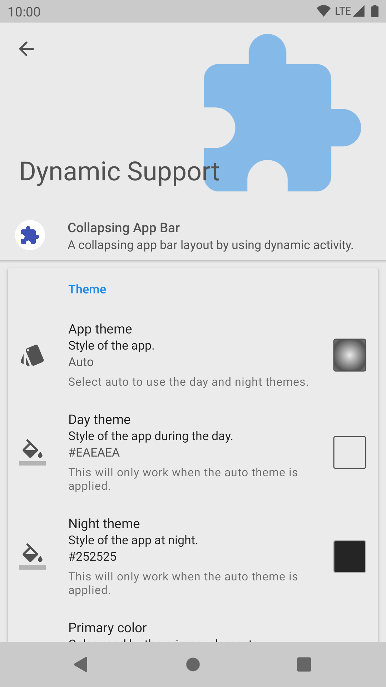

# Dynamic Support

[](https://www.apache.org/licenses/LICENSE-2.0.html)
[](https://search.maven.org/artifact/com.pranavpandey.android/dynamic-support)

A complete library to build apps for Android 4.0 (API 14) and above with a built-in theme engine. 
It is built on top of the latest [app compat library][android-support] to provide best 
compatibility. 

>Since v2.0.0, it uses [AndroidX][androidx] so, first [migrate][androidx-migrate] your project 
to AndroidX.
<br/>Since v3.0.0, it is dependent on Java 8 due to the dependency on 
[DrawerLayout][drawer-layout].

<p align="left">
  
  
</p>

<p align="left">
  
  
</p>

---

## Contents

- [Installation](#installation)
- [Usage](#usage)
    - [Theme engine](#theme-engine)
    - [Background aware](#background-aware)
    - [Sample](#sample)
    - [Dependency](#dependency)
    - [Proguard](#proguard)
- [Projects](#built-with-dynamic)
- [License](#license)

---

## Installation

It can be installed by adding the following dependency to your `build.gradle` file:

```groovy
dependencies {
    // For AndroidX enabled projects.
    implementation 'com.pranavpandey.android:dynamic-support:6.1.1'

    // For legacy projects.
    implementation 'com.pranavpandey.android:dynamic-support:1.3.0'
}
```

---

## Usage

It is a collection of activities, fragments, widgets, views and some utility functions required 
to build a standard Android app. It also provides some built-in use cases like an intro screen, 
drawer activity, about screen, collapsing app bar, navigation bar view, color picker, multiple 
locales, runtime permissions, etc. which can be used and customised according to the requirements.

> For a complete reference, please read the [documentation][documentation].

### Theme engine

Each activity and widget can be themed by using the built-in theme engine with background aware 
functionality to avoid any visibility issues. Colors can be selected by using the provided 
[material design colors][material-design-colors] or by selecting a custom color from the built-in 
picker which supports HEX, HSV, ARGB and CMYK values.

### Background aware

Below are the same colors applied on the light and dark backgrounds respectively. But the final 
color is adjusted according to the colored view background to provide best visibility.

<p align="left">
  
  
</p>

### Sample

This library is fully commented so, please check the individual classes or files for the 
documentation. Basic documentation will be available soon.

Checkout the `sample` to know more about the basic implementation. 

### Dependency

It depends on the [dynamic-theme][dynamic-theme], [dynamic-locale][dynamic-locale] and 
[dynamic-preferences][dynamic-preferences] to perform various internal operations. 
So, their functions can also be used to perform other useful operations.

### Proguard

This library uses reflection at some places to theme widgets at runtime. So, their original name
must be preserved to theme them properly. It will automatically apply the appropriate rules if 
proguard is enabled in the project.

The following rules will be applied by this library:

```yml
# Keep application class.
-keep public class * extends android.app.Application

# Keep methods in Activity that could be used in the XML.
-keepclassmembers class * extends android.app.Activity {
    public void *(android.view.View);
}

# Keep support library classes.
#-keep class android.support.v4.widget.** { *; }
#-keep class android.support.v7.widget.** { *; }
#-keep class android.support.design.widget.** { *; }
#-keep class android.support.design.internal.** { *; }

# Keep AndroidX classes.
-keep class androidx.core.widget.** { *; }
#-keep class androidx.appcompat.widget.** { *; }
-keep class androidx.appcompat.view.menu.** { *; }
-keep class androidx.recyclerview.widget.** { *; }
-keep class androidx.viewpager.widget.** { *; }

# Keep Material Components classes.
-keep class com.google.android.material.internal.** { *; }
-keep class com.google.android.material.navigation.** { *; }
-keep class com.google.android.material.textfield.** { *; }

# Keep all the Dynamic Support models.
-keep class com.pranavpandey.android.dynamic.support.model.** { *; }
-keepclassmembers class * implements android.os.Parcelable {
    static ** CREATOR;
}

# Dynamic Theme rules

# Gson uses generic type information stored in a class file when working with fields.
# Proguard removes such information by default, so configure it to keep all of it.
-keepattributes Signature

# For using Gson annotation.
-keepattributes *Annotation*

# Gson specific classes.
-keep class sun.misc.Unsafe { *; }
-keep class com.google.gson.** { *; }
```

---

## Built with Dynamic

All of my apps are using some or all part of this library. You can download them via Google Play. 
Please email me if you are using this library and want to feature your app here. Also, please 
checkout the `Rotation` and `Everyday` apps to experience the full potential of this library.

<p align="left">
  
  
  
  
  
  
</p>

### Supported

- [EZ Notes][ez-notes]

### Developed

- [Rotation][rotation]
- [Everyday][everyday]
- [Palettes][palettes]
- [Barquode][barquode]
- [Zerocros][zerocros]

---

## Translations

- German (de) - Flubberlutsch
- French (fr) - Nitesh Jha | Others
- Hindi (hi) - Siddh Narhari
- Indonesian (in) - Gamal Kevin A
- Italian (it) - Nicola
- Portuguese (pt) - Jorge Alexandre | Matheus Coelho
- Russian (ru) - Maxim Anisimov
- Spanish (es) - Dave
- Turkish (tr) - Fatih Fırıncı
- Chinese (Simplified) (zh-rCN) - 残念
- Chinese (Traditional) (zh-rTW) - 會呼吸的風 | 人工知能

---

## Author

Pranav Pandey

[](https://github.com/pranavpandey)
[](https://twitter.com/intent/follow?screen_name=pranavpandeydev)
[](https://paypal.me/pranavpandeydev)

---

## License

    Copyright 2018-2022 Pranav Pandey

    Licensed under the Apache License, Version 2.0 (the "License");
    you may not use this file except in compliance with the License.
    You may obtain a copy of the License at

       http://www.apache.org/licenses/LICENSE-2.0

    Unless required by applicable law or agreed to in writing, software
    distributed under the License is distributed on an "AS IS" BASIS,
    WITHOUT WARRANTIES OR CONDITIONS OF ANY KIND, either express or implied.
    See the License for the specific language governing permissions and
    limitations under the License.


[android-support]: https://developer.android.com/topic/libraries/support-library/features.html
[androidx]: https://developer.android.com/jetpack/androidx
[androidx-migrate]: https://developer.android.com/jetpack/androidx/migrate
[drawer-layout]: https://developer.android.com/jetpack/androidx/releases/drawerlayout
[documentation]: https://pranavpandey.github.io/dynamic-support
[material-design-colors]: https://material.io/guidelines/style/color.html
[dynamic-theme]: https://github.com/pranavpandey/dynamic-theme
[dynamic-locale]: https://github.com/pranavpandey/dynamic-locale
[dynamic-preferences]: https://github.com/pranavpandey/dynamic-preferences
[ez-notes]: https://play.google.com/store/apps/details?id=com.pristineusa.android.speechtotext
[rotation]: https://play.google.com/store/apps/details?id=com.pranavpandey.rotation
[everyday]: https://play.google.com/store/apps/details?id=com.pranavpandey.calendar
[palettes]: https://play.google.com/store/apps/details?id=com.pranavpandey.theme
[barquode]: https://play.google.com/store/apps/details?id=com.pranavpandey.matrix
[zerocros]: https://play.google.com/store/apps/details?id=com.pranavpandey.tictactoe
